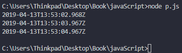
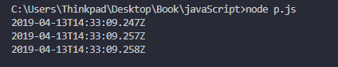
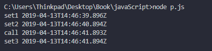
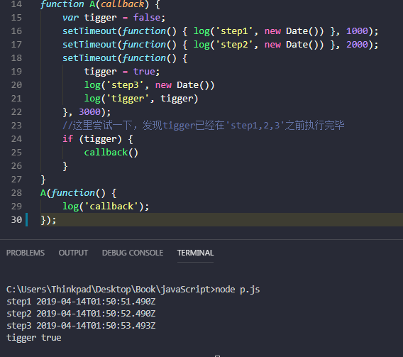
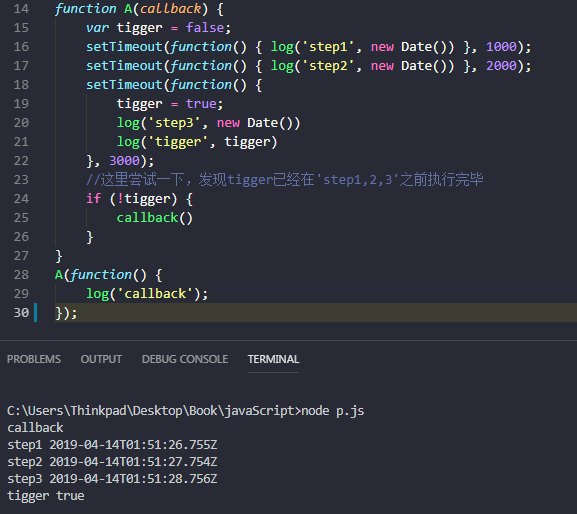
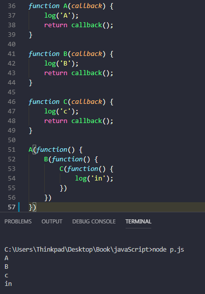
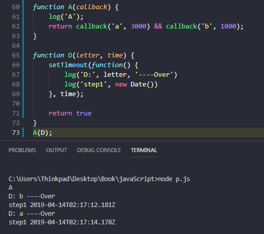

# asynchronous
    实验下javaScript的异步执行
+ 事件轮询机制
+ 回调函数
+ Promise
+ Generator
    [阮一峰](http://es6.ruanyifeng.com/#docs/generator)
+ async/await
# [深入理解ES6异步编程](http://www.ruanyifeng.com/blog/2015/04/generator.html)
    阮一峰
### setTimeOut
+ 实验1
```js
var log = console.log.bind(console);
setTimeout(function() { log(new Date()) }, 1000);//1000ms 
setTimeout(function() { log(new Date()) }, 2000);
setTimeout(function() { log(new Date()) }, 3000);
```

+ 三行 ` setTimeOut() ` 异步执行，它们的 **callback()** 调用时间相差1000ms。但是这个差值有细微区别，并非精确等于1000ms。
#### 说明

可以假设每一行代码都有一个 **执行完毕事件触发器**，哪一行执行完毕触发 **执行完毕事件** ，而js引擎 **轮询** 每一个事件触发器， **轮询** 就会有一定的顺序。比如有一个房间里面有A B C D四个人，A B C 都在写字，A写100个字需要1000ms，B要2000ms，D要3000ms。但是D并不知的他们的写字速度，所以如果D想要知道他们三人的写字速度。首先， *依次* 通知三人开始写字，并分别记录开始时间，这里每个人的开始时间不同，D还要以一定频率依次观察三人写了多少字，并在发现某个人写完字后，记录下结束时间。
+ 实验2
```js
var log = console.log.bind(console);
setTimeout(function() { log(new Date()) }, 1000);
setTimeout(function() { log(new Date()) }, 1000);
setTimeout(function() { log(new Date()) }, 1000);
```

+ 实验3
```js
var log = console.log.bind(console);

function test(callback) {
    callback();
    setTimeout(function() { log('set1', new Date()) }, 1000);
    setTimeout(function() { log('set2', new Date()) }, 2000);
    setTimeout(function() { log('set3', new Date()) }, 3000);
}
test(function() {
    setTimeout(function() { log('call', new Date()) }, 3000)
})
```

### 回调函数
```js
function A(callback) {
    var tigger = false;
    setTimeout(function() { log('step1', new Date()) }, 1000);
    setTimeout(function() { log('step2', new Date()) }, 2000);
    setTimeout(function() {
        tigger = true;
        log('step3', new Date())
        log('tigger', tigger)
    }, 3000);
    //这里尝试一下，发现tigger已经在'step1,2,3'之前执行完毕
    if (tigger) {
        callback()
    }
}
A(function() {
    log('callback');
});
```


#### 回调函数2


+ 注意62行
+ 给一个耗时循环添加回调
+ 简单封装一个循环
```js
function loop(time, todo, callback) {
    for (var i = 0; i < time; i++) {
       (function (){
        todo()
        if (i == time - 1) {
            callback()
        }
       })();
    }

}
```
+ 网上的一个例子
```js
console.log('global')

setTimeout(function() {
    console.log('timeout1')
    new Promise(function(resolve) {
        console.log('timeout1_promise')
        resolve()
    }).then(function() {
        console.log('timeout1_then')
    })
}, 2000)

for (var i = 0; i <= 5; i++) {
    console.log(new Date(), 'for start', i)
    setTimeout(function() {
        if (i == 0) {
            console.log('timeout 0')
        } else {
            console.log(new Date(), 'i has been 6 now')
            console.log(i)
        }
    }, i * 1000)
    console.log(i)
}

new Promise(function(resolve) {
    console.log('promise1', new Date())
    resolve()
}).then(function() {
    console.log('then1')
})

setTimeout(function() {
    console.log('timeout2')
    new Promise(function(resolve) {
        console.log('timeout2_promise', new Date())
        resolve()
    }).then(function() {
        console.log('timeout2_then')
    })
}, 1000)

new Promise(function(resolve) {
    console.log('promise2', new Date())
    setTimeout(() => {
        console.log('promise2->timeout', new Date())
    }, 0);
    console.log('promise2 too')

    resolve()
}).then(function() {
    console.log('then2')
})
```

