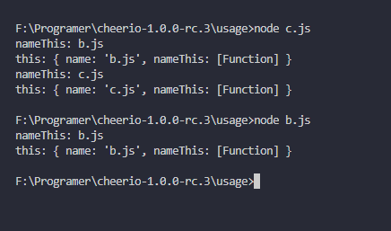

# [cheerio](https://github.com/cheeriojs/cheerio)
    Fast, flexible & lean implementation of core jQuery designed specifically for the server.
## Cheerio.load(str) 
+ return <code>initialize</code>
+ <code>$('.mume-header')</code>===><code>initialize('.mume-header')</code>
+ <code>initialize('.mume-header')</code>
   + return Cheerio.call();
```js
var initialize = function(selector, context, r, opts) {
    if (!(this instanceof initialize)) {
      return new initialize(selector, context, r, opts);
    }
    opts = _.defaults(opts || {}, options);
    return Cheerio.call(this, selector, context, r || root, opts);
  };
```
## parse
1. lib/static.js
```js
  parse = require('./parse');
  var root = parse(content, options, isDocument);
```
2. root==>
```js
{ type: 'root',
  name: 'root',
  namespace: 'http://www.w3.org/1999/xhtml',
  attribs: {},
  'x-attribsNamespace': {},
  'x-attribsPrefix': {},
  children:
   [ { type: 'tag',
       name: 'html',
       namespace: 'http://www.w3.org/1999/xhtml',
       attribs: {},
       'x-attribsNamespace': {},
       'x-attribsPrefix': {},
       children: [Array],
       parent: null,
       prev: null,
       next: null,
       root: [Circular] } ],
  parent: null,
  prev: null,
  next: null }
```
## render 
1. lib/static.js
2. render 源码

```js
var select = require('css-select');
var serialize = require('dom-serializer');
function render(that, dom, options) {
  if (!dom) {
    if (that._root && that._root.children) {
      dom = that._root.children;
    } else {
      return '';
    }
  } else if (typeof dom === 'string') {
    dom = select(dom, that._root, options);
  }

  return serialize(dom, options);
}
```
3. 调用
  + 最外层 **a.js**
```js
const cheerio = require('../index');
const $ = cheerio.load(htmlString);
$('.mume-header').html();
```
  + 第二层 **lib\api\manipulation.js**
```js
var parse = require('../parse'),
    $ = require('../static'),
    updateDOM = parse.update,
    evaluate = parse.evaluate,
    utils = require('../utils'),
    domEach = utils.domEach,
    cloneDom = utils.cloneDom,
    isHtml = utils.isHtml,
    slice = Array.prototype.slice,
    _ = {
      flatten: require('lodash/flatten'),
      bind: require('lodash/bind'),
      forEach: require('lodash/forEach')
    };


/**
 * Set/Get the HTML
 */
exports.html = function(str) {
  if (str === undefined) {
    if (!this[0] || !this[0].children) return null;
    return $.html(this[0].children, this.options);
  }

  var opts = this.options;

  domEach(this, function(i, el) {
    _.forEach(el.children, function(child) {
      child.next = child.prev = child.parent = null;
    });

    var content = str.cheerio ? str.clone().get() : evaluate('' + str, opts, false);

    updateDOM(content, el);
  });

  return this;
};
```
  + 第三层 **lib\static.js**
```js
/**
 * $.html([selector | dom], [options])
 */

exports.html = function(dom, options) {
  // be flexible about parameters, sometimes we call html(),
  // with options as only parameter
  // check dom argument for dom element specific properties
  // assume there is no 'length' or 'type' properties in the options object
  if (Object.prototype.toString.call(dom) === '[object Object]' && !options && !('length' in dom) && !('type' in dom))
  {
    options = dom;
    dom = undefined;
  }

  // sometimes $.html() used without preloading html
  // so fallback non existing options to the default ones
  options = _.defaults(flattenOptions(options || {}), this._options, defaultOptions);

  return render(this, dom, options);
};
```
#### exports 中的 this
b.js 作 exports 模块
```js
/**作为输出模块 */
exports.name = 'b.js';
exports.nameThis = function() {
    console.log('nameThis:', this.name);
    console.log('this:', this);
}
exports.nameThis();
```
c.js 作 require 模块
```js
var b = require('./b.js');
b.name = 'c.js';
b.nameThis();
```

#### ||赋值
```js
console.log(0 || 1); //1
console.log(1 || 0); //1
console.log(9 || 1); //9
console.log(1 || 3 || 0); //1
console.log(0 || 3 || 0); //3
console.log(0 || 0 || 1); //1
console.log(undefined || {}); //{}
console.log(0 && 1); //0
console.log(1 && 0); //0
console.log(1 && 3 && 0); //0
console.log(1 && 3 && 4); //4
console.log(1 && 0 && 4); //0
```
