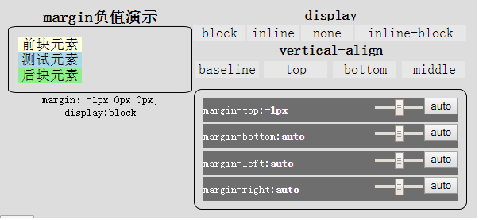

# magrginDemo
  这个例子可以直观的看到margin值变化对元素的影响
  




```html
<!DOCTYPE html>
<html lang="en">
<head>
<meta charset="UTF-8">
<title>Document</title>
<style>
body,dl,dd,h2{
  margin: 0;
}
h2{
  font-size:20px;
}
.box{
overflow: hidden;
width:276px;
padding:10px;
background-color: #ddd;
text-align: center;
position:relative;
font:18px/1.2 "宋体";
} 
.con{
float:left;
width:100%;
}
.show{
float:left;
width:100%;
}
.show-body{
border: 1px solid black;
border-radius: 5%;
padding: 5%;
}

#show-img{
min-height: 20px;
font-size:14px;
}

.con dl *{
float: left;
overflow:hidden;
}

.con dl+dl{
margin-top: 1%;
} 
.con dt{
font-weight: bold;
width: 100%;
}

.con dd{
background-color: rgba(255,255,255,0.3);
margin: 1%;
cursor: pointer;
width: 23%;
} 

.con dl:first-child dd{
width: 19%; 
margin: 1px;
}
.con dl:first-child :last-child{width: 40%;}
@media (min-width:600px) {
.con{width:60%;}.show{width:40%;}.box{width:580px;}
}
ul{
margin: 0;padding:0;
list-style: none;
} 
.l{float: left;}
.r{float: right;}
.con-ul{
display:inline-block;
vertical-align: top;
width: 94%;
border: 1px solid black;
overflow: hidden;
padding: 2%;
border-radius: 10px;
margin-top: 10px;
}
.con-ul li{
height: 30px;
line-height: 30px;
font-size: 14px;
background-color: rgba(0,0,0,0.5);
text-align: left;
color: white;
cursor: pointer;
margin: 1%; 
overflow: hidden;
}
.con-ul li input{width: 60px;}
</style>
</head>
<body>
<div class="box" id="box">
  <div class="show">
    <h2 class="show-tit">margin负值演示</h2>
    <div class="show-body" id="sb">
      <!-- 添加结构单元 -->
      <div style="background-color: lightyellow;width:80px;height: 20px;line-height: 20px;">前块元素</div>        
      <div id="oShow" style="background-color: lightblue;width:80px;height: 20px;line-height: 20px;">测试元素</div>
      <div   style="background-color: lightgreen;width:80px;height: 20px;line-height: 20px;">后块元素</div>   
      <!-- 添加结构单元结束 -->
    </div>
    <div id="show-img"></div>
    <button id="reset" style="position: absolute; left:0;bottom:0;margin-bottom: -20px;">还原</button>
  </div>
  <div class="con">
    <dl>
      <dt>display</dt>
      <dd>block</dd>
      <dd>inline</dd>
      <dd>none</dd>
      <dd class="dd1">inline-block</dd>
    </dl>
    <dl class="dl1">
      <dt>vertical-align</dt>
      <dd>baseline</dd>
      <dd>top</dd>
      <dd>bottom</dd>
      <dd>middle</dd>
    </dl>
    <ul class="con-ul" id="conUl">
          <li data-name="margin-top"><span class="l" >margin-top:<b>auto</b></span><button class="r">auto</button><input class="r" type="range" min="-100" max="100" step="1" value="0" ></li>
      <li data-name="margin-bottom"><span class="l">margin-bottom:<b>auto</b></span><button class="r">auto</button><input class="r" type="range" min="-100" max="100" step="1" value="0" ></li>          
      <li data-name="margin-left"><span class="l" >margin-left:<b>auto</b></span><button class="r">auto</button><input class="r" type="range" min="-100" max="100" step="1" value="0" ></li>
      <li data-name="margin-right"><span class="l" >margin-right:<b>auto</b></span><button class="r">auto</button><input class="r" type="range" min="-100" max="100" step="1" value="0" ></li>
              
    </ul>
  </div>

</div>  

<script>
function getCSS(obj,style){
    if(window.getComputedStyle){
        return getComputedStyle(obj)[style];
    }
    return obj.currentStyle[style];
};

(function con(){
  var oBox = document.getElementById('box');
  var aDl = oBox.getElementsByTagName('dl');
  var oShow = document.getElementById('oShow');
  var oImg = document.getElementById('show-img');
  var conChildren = conUl.children;
  reset.onclick = function(){
    history.go();
  }
  for(var i = 0; i < conChildren.length; i++){
    conChildren[i].index = i;
    var oFocus = conChildren[i].getElementsByTagName('input')[0];
    conChildren[i].getElementsByTagName('button')[0].onclick = oFocus.onpropertychange = oFocus.oninput = oFocus.onchange = function(){
      if(this.value === ''){
        this.parentNode.getElementsByTagName('b')[0].innerHTML = 'auto';
      }else{
        this.parentNode.getElementsByTagName('b')[0].innerHTML = this.value + 'px';
      }
      if(this.parentNode.dataset){
        oShow.style[this.parentNode.dataset.name] = this.parentNode.getElementsByTagName('b')[0].innerHTML;     
      }else{
        oShow.style[this.parentNode.getAttribute('data-name')] = this.parentNode.getElementsByTagName('b')[0].innerHTML;
      }
        oImg.innerHTML = 'margin：' + getCSS(oShow,'margin') + '; ' + 'display:' + getCSS(oShow,'display');  
    }

    conChildren[i].onmouseover = function(){
      this.style.color = "rgb(39,184,231)";
    }
    conChildren[i].onmouseout = function(){
      this.style.color = "white";
    } 
  }

  for(var i = 0, leni = aDl.length; i < leni; i++){
    var oDt = aDl[i].getElementsByTagName('dt')[0];
    var aDd = aDl[i].getElementsByTagName('dd');
    aDl[i].last = 0;
    for(var j = 0,lenj = aDd.length; j < lenj; j++){
      aDd[j].index = j;
      aDd[j].onclick = function(){
        var oDl = this.parentNode;
        var oDt = oDl.getElementsByTagName('dt')[0];
        var aDd = oDl.getElementsByTagName('dd');
        aDd[oDl.last].style.cssText = 'color: black; background-color: rgba(255,255,255,0.3);'; 
        this.style.cssText = 'color: white; background-color: black;';
          oShow.style[oDt.innerHTML] = this.innerHTML;
        oImg.innerHTML = 'margin：' + getCSS(oShow,'margin') + '; ' + 'display:' + getCSS(oShow,'display');  
        oDl.last = this.index;
      }
    }
  } 
})();
</script>
</body>
</html>

```
